ST0263 Tópicos Especiales en Telemática

Estudiante: Juan Esteban Avendaño Castaño, jeavendanc@eafit.edu.co

Profesor: Álvaro Ospina, aeospinas@eafit.edu.co

# Nombre del proyecto: Reto 1 y 2
# 1. Breve descripción de la actividad

Sistema distribuido para compartir archivos basado en un esquema de red P2P no estructurada con servidor de directorio y localización.

## 1.1. Que aspectos cumplió o desarrolló de la actividad propuesta por el profesor (requerimientos funcionales y no funcionales)
### Requisitos funcionales
- Los procesos podrán consultar la ubicación de archivos en la red P2P.
- La comunicación será concurrente, permitiendo que varios procesos se comuniquen simultáneamente
- Los procesos podrán simular la carga y descarga de archivos entre sí
- La transferencia de archivos se realizará entre el proceso que tiene el archivo y el proceso que lo solicita
- Los procesos podrán leer una configuración dinámica al momento de iniciar
- El proceso PServer está basado en microservicios
- El sistema implementará comunicación basada en gRPC y API REST
- El sistema se despliega usando contenedores

### Requisitos no funcionales

- Mantenibilidad
- Disponibilidad
- Escalabilidad
- Rendimiento

## 1.2. Que aspectos NO cumplió o desarrolló de la actividad propuesta por el profesor (requerimientos funcionales y no funcionales)

No se hace uso de MOM (Instrucciones dadas por el profesor).


# 2. información general de diseño de alto nivel, arquitectura, patrones, mejores prácticas utilizadas.
### Diagrama de arquitectura

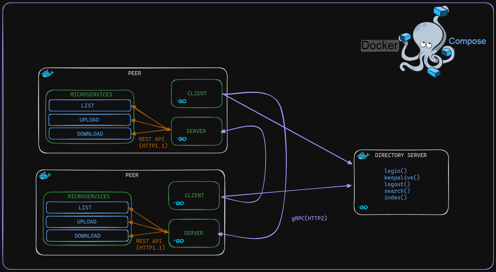

### Mejores Prácticas

- Distribución modular: Los modulos y microservicios se dividieron en sus propios archivos y carpetas, de forma que sean fáciles de localizar y modificar.
- Escalabilidad horizontal: La arquitectura P2P permite un escalamiento horizontal al añadir más peers a la red.
- Configuraciones: Las configuraciones se hacen por medio de argumentos de comando o por variables de entorno, por
lo que que no hay puertos o direcciones IP directamente en el código
- Manejo de errores: Se implementó el manejo de error para evitar fallas graves del sistema.

# 3. Descripción del ambiente de desarrollo y técnico: lenguaje de programación, librerias, paquetes, etc, con sus numeros de versiones.

## Lenguajes de programación

Tanto para para el desarrollo de los peers como para el desarrollo del servidor central se hizo uso del lenguaje de programación [Go](https://go.dev/).

## Principales librerias empleadas y sus versiones
Go version=1.22.0
- grpc⋅v1.62.0
- protobuf⋅v1.32.0
- gin⋅v1.9.1
- godotenv⋅v1.5.1

## Como se compila y ejecuta.

> [!IMPORTANT]  
> Para ejecutar y compilar este proyecto se usa [ Docker Compose](https://docs.docker.com/compose/).

Luego de tener `docker-compose` istalado, el primer paso para ejecutar el proyecto es clonar el repositorio:
``` bash 
$ git clone https://github.com/Adrephos/jeavendanc-st0263
$ cd jeavendanc-st0263
```
Con esto ya solo falta buildear y configurar los contenedores usando `docker-compose`:
``` bash
$ docker-compose build 
$ docker-compose up
```

De esta forma ya tendríamos nuestros peers y servidor de directorios configurados:
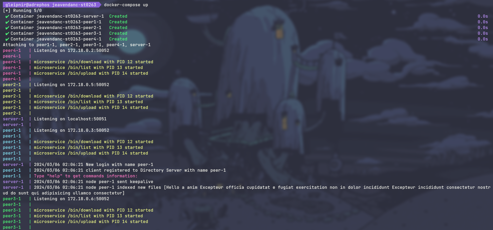
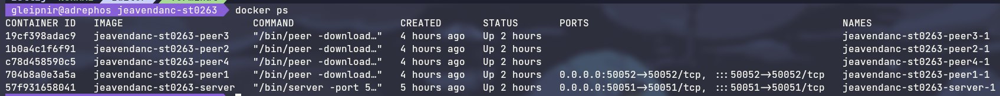


## Detalles del técnicos y de desarrollo

### Peers
Para el desarrollo de los peers se usó Go como lenguaje de programación. Par comunicar los peers entre sí
y con el servidor de directorios se usó gRPC.

El módulo servidor de cada peer expone los siguientes métodos:
- Download: se encarga de simular la descarga de archivos
- List: se encarga de simular la descarga de archivos
- Upload: se encarga de simular la descarga de archivos

Estos métodos a su vez son microservicios que corren en el peer y se comunican con el módulo servidor usando
REST API. En la siguiente imagen se pueden ver los procesos que ejecutaría un peer y se evidencia el uso de microservicios:
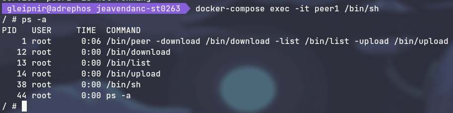

### Directory Server
Para el desarrollo del server se usó Go como lenguaje de programación y se empleó gRPC para las comunicaciones con los peers.
Además se implementó una base de datos llave/valor en memoria para el almacenamiento de los peers que se encuentran en línea.

El servidor de directorios expone los siguientes métodos a los peers:
- Login: Regristra los peers y los añade a la base de datos
- Keepalive: Los peers lo envían periodicamente para asegurar su conectividad
- Logout: Se envía cuando un peer se desconecta
- Search: Realiza un búsqueda del archivo en la base de datos y entrega las `url`
de los peers que contengan el archivo
- Index: Se utiliza para indexar los archivos que un peer contenga
- GetPeers: Se usa para saber los peers que están conectados en ese instante

## Descripción y como se configura los parámetros del proyecto (ej: ip, puertos, conexión a bases de datos, variables de ambiente, parámetros, etc)

Para la configuración del proyecto, principalmente se hace uso de los argumentos de comando. Para saber los parámetros o
flags que contiene un peer o el servidor basta con ejecutarlo con la flag `-h`:
|                              |
|------------------------------|
| 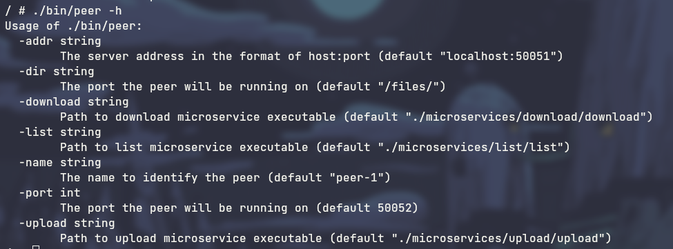 |
| 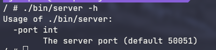 |

Entonces para configurar el puerto de un peer al puerto `3000` se ejecutaría de la siguien manera:
```bash
$ ./bin/peer -port 3000
```

Por otra parte, el peer tambien permite la configuración del nombre, dirección del servidor de directorios
y puerto por medio de las siguientes variables de entorno:

- PEER_NAME
- DIR_SERVER_ADDR
- PORT

> [!WARNING]  
> Tener en cuenta que estas sobreescriben a los argumentos por linea de comando

## Opcional - detalles de la organización del código por carpetas o descripción de algún archivo. (ESTRUCTURA DE DIRECTORIOS Y ARCHIVOS IMPORTANTE DEL PROYECTO, comando 'tree' de linux)
# Estructura de directorios
```bash
.
├── DirectoryServer
│   ├── Dockerfile
│   ├── go.mod
│   ├── go.sum
│   ├── main.go
│   ├── proto
│   │   ├── directory_service.pb.go
│   │   ├── directory_service.proto
│   │   └── directory_service_grpc.pb.go
│   └── server
│       └── server.go
├── Peer
│   ├── Dockerfile
│   ├── client
│   │   └── client.go
│   ├── go.mod
│   ├── go.sum
│   ├── main.go
│   ├── microservices
│   │   ├── download
│   │   │   ├── go.mod
│   │   │   ├── go.sum
│   │   │   └── main.go
│   │   ├── list
│   │   │   ├── go.mod
│   │   │   ├── go.sum
│   │   │   └── main.go
│   │   └── upload
│   │       ├── go.mod
│   │       ├── go.sum
│   │       └── main.go
│   ├── proto
│   │   ├── directory_service.pb.go
│   │   ├── directory_service.proto
│   │   ├── directory_service_grpc.pb.go
│   │   ├── peer.pb.go
│   │   ├── peer.proto
│   │   └── peer_grpc.pb.go
│   ├── server
│   │   └── server.go
│   └── utils
│       ├── cmd
│       │   └── command_input.go
│       ├── files
│       │   └── files.go
│       ├── microservices
│       │   └── ms.go
│       └── rpc
│           └── rpc.go
├── README.md
└── docker-compose.yml
```

## Una mini guia de como un usuario utilizaría el software o la aplicación
Al ejecutar un peer, este tendra una CLI. Esta se ve de la siguiente manera:
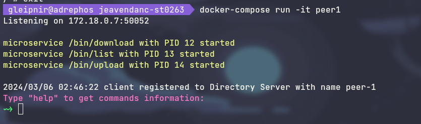

Con el comando `help` se obtiene ayuda sobre los demás comandos y su uso:
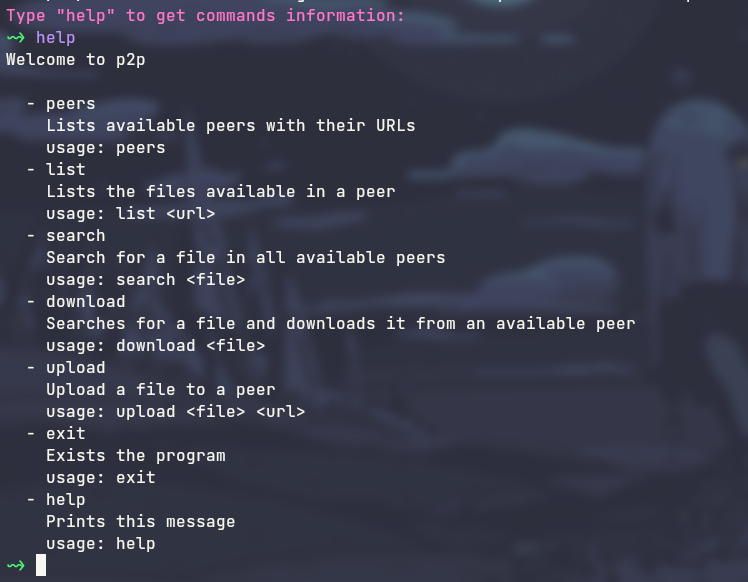

Si por ejemplo ejecutamos el comando `peers` obtendremos la siguiente salida:
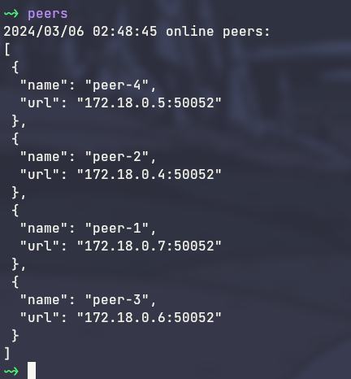

## Opcionalmente - si quiere mostrar resultados o pantallazos 

### Menu CLI


### Search
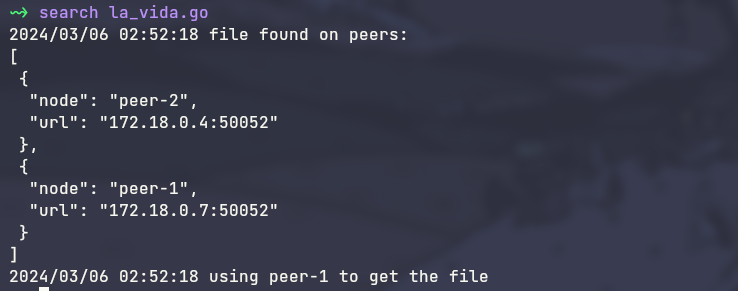

### Download
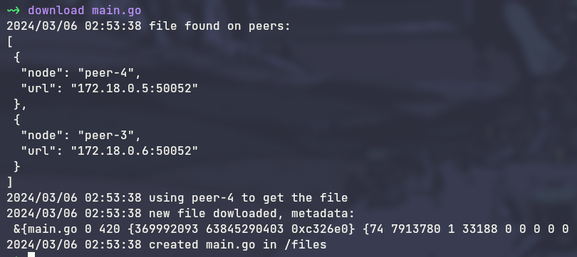

### Upload
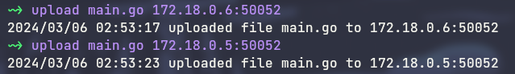

# Referencias:
- gRPC: https://grpc.io/docs/
- Gin Web Framework: https://gin-gonic.com/docs/
